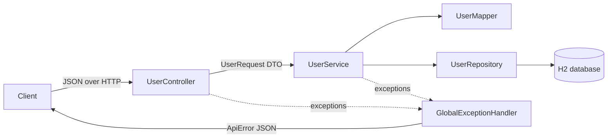

# Spring Boot API Verification Demo


A small, production-style **User Management REST API** built with Java 21 and Spring Boot 3. It focuses on what usually
separates a working API from a reliable one: input validation, business-rule enforcement, a consistent error contract,
explicitly documented edge cases, and tests that verify each of them.

---

## 1. Project Overview

The API supports create, read, update, delete and search-by-email for users. Every request is either:

- **accepted**, with the correct success status (`200`, `201`, `204`), or
- **rejected** with the correct error status (`400`, `404`, `409`, `415`, `500`) and a predictable JSON error body that
  says what went wrong and, for validation errors, which fields.

Each behaviour is written down in [`docs/verification-scenarios.md`](docs/verification-scenarios.md) and verified by
unit, web-layer and integration tests.

## 2. Why this project exists

This is a personal project. In backend work, most production defects I have seen were not in the happy path. They came
from inputs nobody wrote down: a `0` id, an email that differs only by case, a fractional age that silently truncates,
a body with an extra field, an exception message leaking into a response.

The project is a compact, reviewable example of how I approach that:

1. Define the expected behaviour for each input class **before** trusting the implementation.
2. Make the API **strict and explicit** instead of silently "fixing" bad input.
3. Back every documented behaviour with a **focused test** at the right level.

It is intentionally small so the reasoning is easy to follow.

## 3. Architecture



| Layer | Responsibility |
|-------|----------------|
| `controller` | HTTP only: routing, `@Valid` trigger, status codes, `Location` header. No business logic. |
| `service` | Business rules: positive id, existence, case-insensitive email uniqueness, timestamps, transactions. |
| `repository` | Spring Data JPA queries. |
| `entity` | JPA model (`User`, `UserStatus`). Never returned from the API. |
| `dto` | `UserRequest` (validated input), `UserResponse` (output), `ApiError` (error contract). |
| `mapper` | DTO ↔ entity conversion and input normalization (trim name, lower-case email). |
| `exception` | Domain exceptions, `ErrorType` codes, and the `@RestControllerAdvice` handler. |
| `config` | `Clock` bean so time-dependent logic is testable. |

```
src
├── main
│   ├── java/com/example/apiverification
│   │   ├── ApiVerificationDemoApplication.java
│   │   ├── config/ClockConfig.java
│   │   ├── controller/UserController.java
│   │   ├── dto/{UserRequest, UserResponse, ApiError}.java
│   │   ├── entity/{User, UserStatus}.java
│   │   ├── exception/{ApiException, ErrorType, GlobalExceptionHandler, ...}.java
│   │   ├── mapper/UserMapper.java
│   │   ├── repository/UserRepository.java
│   │   └── service/UserService.java
│   └── resources/application.properties
└── test/java/com/example/apiverification
    ├── controller/UserControllerTest.java
    ├── dto/UserRequestValidationTest.java
    ├── integration/UserApiIntegrationTest.java
    └── service/UserServiceTest.java
```

## 4. Technology Stack

| Area | Choice |
|------|--------|
| Language | Java 21 |
| Framework | Spring Boot 3.5 (Spring Web, Spring Validation, Spring Data JPA) |
| Persistence | Hibernate, H2 in-memory database |
| Build | Maven |
| Testing | JUnit 5, Mockito, AssertJ, Spring MockMvc |
| Manual verification | Postman collection with assertions |
| CI | GitHub Actions (`mvn verify` on every push / PR) |

## 5. API Endpoints

Base URL: `http://localhost:8080`

| Method | Path | Success | Description |
|--------|------|---------|-------------|
| `POST` | `/api/users` | `201 Created` + `Location` | Create a user |
| `GET` | `/api/users` | `200 OK` | List all users, ordered by id |
| `GET` | `/api/users/{id}` | `200 OK` | Get a user by id |
| `PUT` | `/api/users/{id}` | `200 OK` | Replace a user's fields (all fields required) |
| `DELETE` | `/api/users/{id}` | `204 No Content` | Delete a user |
| `GET` | `/api/users/search?email={email}` | `200 OK` | Find a user by email (case-insensitive) |

User representation:

| Field | Type | Set by |
|-------|------|--------|
| `id` | number | server |
| `name` | string | client |
| `email` | string | client (stored lower-case) |
| `age` | integer | client |
| `status` | `ACTIVE` \| `INACTIVE` | client |
| `createdAt` | ISO-8601 UTC timestamp | server, never changes |
| `updatedAt` | ISO-8601 UTC timestamp | server, refreshed on every update |

## 6. Validation Rules

| Field | Rule | Error message |
|-------|------|---------------|
| `name` | required, not blank | Name is required |
| `name` | max 100 characters; surrounding spaces trimmed | Name must not exceed 100 characters |
| `email` | required | Email is required |
| `email` | valid format **and** a dot in the domain (`user@localhost` is rejected) | Email must be a valid email address |
| `email` | max 254 characters | Email must not exceed 254 characters |
| `email` | unique, case-insensitive | *409 DUPLICATE_EMAIL* |
| `age` | required, whole number | Age is required |
| `age` | 18 to 100 inclusive | Age must be at least 18 / Age must not exceed 100 |
| `status` | required | Status is required |
| `status` | exactly `ACTIVE` or `INACTIVE` (case-sensitive) | Status must be ACTIVE or INACTIVE |
| `{id}` | positive number | *400 INVALID_ID* |

**Strict JSON parsing** (configured in `application.properties`):

- Unknown fields such as `id`, `createdAt` or a typo like `emial` are **rejected**, not ignored.
- `"age": 17.9` is **rejected**, not truncated to `17`.
- `"age": "30"` is **rejected**, not coerced to `30`.

## 7. Error Handling

`GlobalExceptionHandler` (`@RestControllerAdvice`) turns every failure into the same JSON shape:

```json
{
  "timestamp": "2026-01-15T10:30:00.123Z",
  "status": 404,
  "error": "USER_NOT_FOUND",
  "message": "User with id 42 was not found",
  "path": "/api/users/42"
}
```

Validation failures also include `fieldErrors`, sorted by field name:

```json
"fieldErrors": [
  { "field": "age",   "message": "Age must be at least 18" },
  { "field": "email", "message": "Email must be a valid email address" }
]
```

| `error` | Status | Raised when |
|---------|--------|-------------|
| `VALIDATION_FAILED` | 400 | Body fails bean validation |
| `MALFORMED_REQUEST` | 400 | Body missing, invalid JSON, wrong shape, unknown field, wrong type |
| `INVALID_ID` | 400 | Id is zero, negative, non-numeric or out of range |
| `INVALID_PARAMETER` | 400 | Search `email` parameter missing or blank |
| `USER_NOT_FOUND` | 404 | No user with that id / email |
| `RESOURCE_NOT_FOUND` | 404 | No endpoint at that path |
| `METHOD_NOT_ALLOWED` | 405 | e.g. `PATCH /api/users/1` (response includes an `Allow` header) |
| `DUPLICATE_EMAIL` | 409 | Email already used by another user |
| `DATA_CONFLICT` | 409 | Database constraint violated (e.g. concurrent duplicate create) |
| `UNSUPPORTED_MEDIA_TYPE` | 415 | Body not sent as `application/json` |
| `INTERNAL_ERROR` | 500 | Anything unexpected; details are logged, **never** returned |

Design decisions:

- **Stable codes over messages.** Clients branch on `error`; messages can change wording safely.
- **No internals in responses.** Parser messages, class names, SQL and stack traces stay in server logs.
- **Defense in depth for uniqueness.** The service checks first for a clear message; a database unique constraint
  catches the race where two requests create the same email at the same time.

## 8. Verification Scenarios

[`docs/verification-scenarios.md`](docs/verification-scenarios.md) documents 18 scenarios. Each one lists the input,
expected HTTP status, expected behavior, why the case matters, and the tests that cover it. Highlights:

| Scenario | Expected |
|----------|----------|
| Valid request | 201, normalized name/email, `Location` header |
| Missing required fields (`{}`) | 400, all four field errors in one response |
| Invalid email (incl. `user@localhost`) | 400 `VALIDATION_FAILED` |
| Duplicate email, different case | 409 `DUPLICATE_EMAIL` |
| Non-existent user | 404 `USER_NOT_FOUND` |
| Negative / zero id | 400 `INVALID_ID`, database not queried |
| Age 17 / 101 (and 18 / 100 accepted) | 400 at both bounds, inclusive limits |
| Invalid status (`PENDING`, `active`) | 400 `VALIDATION_FAILED` |
| Malformed JSON / empty body | 400 `MALFORMED_REQUEST` with distinct messages |
| Update keeping own email | 200 (uniqueness check excludes self) |
| Unexpected exception | 500 with no internal details |

The document also describes the **order** in which checks run, which decides the response when a request has more than one problem.

## 9. Testing

Tests are split by what they verify:

| Test class | Type | Verifies |
|------------|------|----------|
| `UserRequestValidationTest` | Unit (Bean Validation, no Spring) | Every field rule, including both sides of each boundary |
| `UserServiceTest` | Unit (JUnit 5 + Mockito) | Business rules: duplicates, not-found, invalid ids, update/delete, timestamps |
| `UserControllerTest` | Web slice (`@WebMvcTest`, service mocked) | Status codes, error contract, malformed input, type mismatches, 405/415, no leakage on 500 |
| `UserApiIntegrationTest` | Integration (`@SpringBootTest` + H2) | Full CRUD lifecycle, case-insensitive uniqueness, route matching, persisted timestamps |

Principles followed:

- **Descriptive names** that read as specifications, e.g. `shouldRejectDuplicateEmail`, `shouldRejectAgeBelowMinimum`,
  `shouldReturnNotFoundWhenUserDoesNotExist`, `shouldRejectFractionalAgeInsteadOfTruncatingIt`.
- **Boundaries tested on both sides** (17 rejected / 18 accepted, 100 accepted / 101 rejected).
- **Parameterized tests** for input classes (invalid emails, invalid statuses) instead of copy-pasted tests.
- **Negative assertions**: rejected requests must not call `save`, invalid ids must not query the repository,
  and a 500 must not contain the exception text.
- **Deterministic time**: the service uses an injected `Clock`, so timestamp assertions are exact in unit tests.
- **Mocks only at boundaries**: the repository is mocked in unit tests, but the mapper is real, so normalization
  bugs cannot be hidden by a mock.

Run them with `mvn test` (see below).

## 10. How to Run

**Prerequisites:** JDK 21 and Maven 3.9+ (`java -version`, `mvn -version`).

```bash
git clone https://github.com/dongarekajal1234-ma/spring-boot-api-verification-demo.git
cd spring-boot-api-verification-demo

# run the application on http://localhost:8080
mvn spring-boot:run

# or build a jar and run it
mvn clean package
java -jar target/spring-boot-api-verification-demo-1.0.0.jar
```

Run tests:

```bash
mvn test                                   # all tests
mvn clean verify                           # full build + all tests (same as CI)
mvn test -Dtest=UserServiceTest            # one class
mvn test -Dtest=UserControllerTest#shouldRejectMalformedJson   # one method
```

The H2 database is in-memory, so data resets on every restart. No credentials or external services are required.

## 11. Example API Requests/Responses

**Create a user**

```bash
curl -i -X POST http://localhost:8080/api/users \
  -H "Content-Type: application/json" \
  -d '{"name": "Asha Verma", "email": "Asha.Verma@Example.com", "age": 30, "status": "ACTIVE"}'
```

```http
HTTP/1.1 201 Created
Location: http://localhost:8080/api/users/1
Content-Type: application/json

{
  "id": 1,
  "name": "Asha Verma",
  "email": "asha.verma@example.com",
  "age": 30,
  "status": "ACTIVE",
  "createdAt": "2026-01-15T10:30:00.123Z",
  "updatedAt": "2026-01-15T10:30:00.123Z"
}
```

**Validation failure**

```bash
curl -s -X POST http://localhost:8080/api/users \
  -H "Content-Type: application/json" \
  -d '{"name": "", "email": "asha@", "age": 17, "status": "PENDING"}'
```

```json
{
  "timestamp": "2026-01-15T10:31:12.456Z",
  "status": 400,
  "error": "VALIDATION_FAILED",
  "message": "Request validation failed",
  "path": "/api/users",
  "fieldErrors": [
    { "field": "age",    "message": "Age must be at least 18" },
    { "field": "email",  "message": "Email must be a valid email address" },
    { "field": "name",   "message": "Name is required" },
    { "field": "status", "message": "Status must be ACTIVE or INACTIVE" }
  ]
}
```

**Duplicate email (different case)**

```bash
curl -s -X POST http://localhost:8080/api/users \
  -H "Content-Type: application/json" \
  -d '{"name": "Someone Else", "email": "ASHA.VERMA@example.com", "age": 40, "status": "ACTIVE"}'
```

```json
{
  "timestamp": "2026-01-15T10:32:00.789Z",
  "status": 409,
  "error": "DUPLICATE_EMAIL",
  "message": "A user with email asha.verma@example.com already exists",
  "path": "/api/users"
}
```

**Other calls**

```bash
curl -s http://localhost:8080/api/users
curl -s http://localhost:8080/api/users/1
curl -s "http://localhost:8080/api/users/search?email=asha.verma@example.com"
curl -s -X PUT http://localhost:8080/api/users/1 -H "Content-Type: application/json" \
  -d '{"name": "Asha Rao", "email": "asha.verma@example.com", "age": 31, "status": "INACTIVE"}'
curl -i -X DELETE http://localhost:8080/api/users/1      # 204
curl -s http://localhost:8080/api/users/-1               # 400 INVALID_ID
curl -s http://localhost:8080/api/users/999              # 404 USER_NOT_FOUND
```

> Windows PowerShell: use `curl.exe` instead of `curl`, and escape inner quotes, or use the Postman collection.

## 12. Postman Collection

[`postman/Spring-Boot-API-Verification-Demo.postman_collection.json`](postman/Spring-Boot-API-Verification-Demo.postman_collection.json)

1. Start the application.
2. In Postman: **Import** → select the file.
3. Open the collection → **Run** (Collection Runner) to execute all requests in order.

The collection has three folders: happy path, validation and error cases, and delete-and-confirm. Every request has
test scripts that assert the expected status and `error` code. The create request generates a unique email on each run,
so the collection can be re-run without restarting the app. `baseUrl` defaults to `http://localhost:8080`.

## 13. Project Limitations

These are deliberate scope limits for a demo, not oversights:

- **No authentication or authorization.** Any caller can read or modify any user.
- **No pagination** on `GET /api/users`; unsuitable for large data sets.
- **In-memory H2** with `create-drop` schema; no migrations, data is lost on restart.
- **No optimistic locking.** Two concurrent `PUT`s on the same user: the last write wins silently.
- **`PUT` only.** There is no `PATCH`; partial updates are not supported.
- **Hard delete.** Deleted users cannot be restored.
- **Error messages echo the email** in duplicate / not-found responses, which is convenient for a demo but
  may be undesirable in a real system for privacy reasons.
- English-only messages; no rate limiting.

## 14. Future Improvements

- Pagination and sorting (`Pageable`) for the list endpoint.
- Optimistic locking with `@Version` and `ETag` / `If-Match` headers.
- PostgreSQL with Flyway migrations, and integration tests on the real database using Testcontainers.
- OpenAPI / Swagger UI documentation generated from the controllers.
- Spring Security with role-based access.
- JaCoCo coverage report with a minimum threshold in CI.
- Dockerfile for container-based runs.
- `PATCH` support with explicit null-vs-absent semantics.

---

## License

[MIT](LICENSE)
